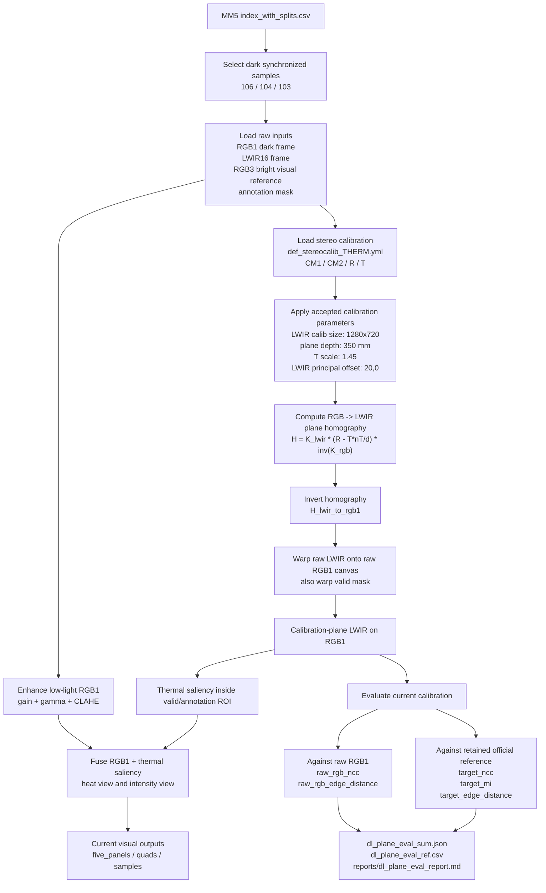

# Calibration Plane Method Flowchart

```mermaid
flowchart TD
    A["MM5 index_with_splits.csv"] --> B["Select dark synchronized samples<br/>106 / 104 / 103"]
    B --> C["Load raw inputs<br/>RGB1 dark frame<br/>LWIR16 frame<br/>RGB3 bright visual reference<br/>annotation mask"]
    C --> D["Load stereo calibration<br/>def_stereocalib_THERM.yml<br/>CM1 / CM2 / R / T"]
    D --> E["Apply accepted calibration parameters<br/>LWIR calib size: 1280x720<br/>plane depth: 350 mm<br/>T scale: 1.45<br/>LWIR principal offset: 20,0"]
    E --> F["Compute RGB -> LWIR plane homography<br/>H = K_lwir * (R - T*nT/d) * inv(K_rgb)"]
    F --> G["Invert homography<br/>H_lwir_to_rgb1"]
    G --> H["Warp raw LWIR onto raw RGB1 canvas<br/>also warp valid mask"]
    H --> I["Calibration-plane LWIR on RGB1"]
    C --> J["Enhance low-light RGB1<br/>gain + gamma + CLAHE"]
    I --> K["Thermal saliency inside valid/annotation ROI"]
    J --> L["Fuse RGB1 + thermal saliency<br/>heat view and intensity view"]
    K --> L
    L --> M["Current visual outputs<br/>five_panels / quads / samples"]
    I --> N["Evaluate current calibration"]
    N --> O["Against raw RGB1<br/>raw_rgb_ncc<br/>raw_rgb_edge_distance"]
    N --> P["Against retained official reference<br/>target_ncc<br/>target_mi<br/>target_edge_distance"]
    O --> Q["dl_plane_eval_sum.json<br/>dl_plane_eval_ref.csv<br/>reports/dl_plane_eval_report.md"]
    P --> Q
```

